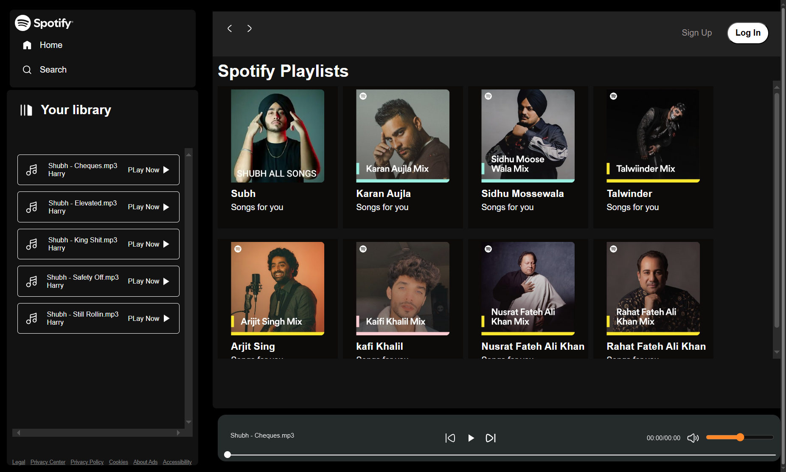

# Spotify Clone 🎵

A responsive **Spotify-inspired music player** built using **HTML**, **CSS**, and **JavaScript**.  
Features include track playback, playlist display, progress control, and a modern, responsive UI.

## 🚀 Features

- Play / Pause / Next / Previous controls
- Playlist with clickable tracks
- Progress bar with seek
- Responsive design for all devices

## 📸 Screenshots




## 📂 Tech Stack

- HTML
- CSS
- JavaScript

## 📦 Installation

```bash
git clone https://github.com/yourusername/spotify-clone.git
```
